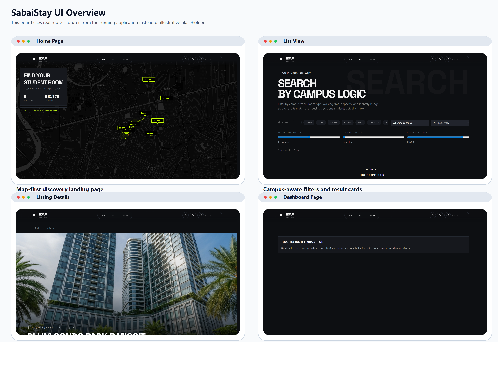

# Sabai Stay

Sabai Stay is a university-focused student housing platform for discovering,
evaluating, and managing off-campus accommodation. The app combines
campus-aware search, utility transparency, booking workflows, contracts,
roommate matching, reviews, notifications, and owner/student operations in a
single web application.



## Overview

This repository contains the current implementation of Sabai Stay as a:

- React 19 + Vite single-page application
- TypeScript + Express API server
- Supabase Auth + PostgreSQL backend
- shared Zod contract layer between client and server

The codebase is designed around real university housing workflows rather than a
generic booking template:

- campus-zone and transport-aware listing discovery
- utility estimation for total monthly cost visibility
- request-based booking workflow with contract states
- owner listing management and booking actions
- roommate profile, matching, and messaging flows
- reviews, notifications, verification tasks, and dispute handling

## Feature Highlights

- `Campus-aware discovery`
  Search listings by campus zone, room type, walking time, budget, and
  capacity.
- `Utility transparency`
  Estimate electricity, water, internet, and service costs directly from the
  listing page.
- `Booking workflow`
  Move bookings through `requested`, `approved`, `deposit_pending`,
  `confirmed`, `rejected`, and `cancelled`.
- `Contract tracking`
  Link bookings to contract records and contract document metadata.
- `Roommate matching`
  Store preferences, compute compatibility, and support student messaging.
- `Owner workflows`
  Manage listings, respond to reviews, and process booking/contract actions.
- `Supabase-backed persistence`
  Persist app data in PostgreSQL with row-level security and auth profile sync
  triggers.

## Screens and Flows

Current routes:

- `/` map-first home page
- `/list` filterable listing search
- `/listing/:id` listing details, utilities, reviews, booking flow
- `/dashboard` role-based owner and student dashboard

Additional project diagrams and paper-ready assets are available in
[`docs/diagrams`](./docs/diagrams/README.md).

## Tech Stack

### Frontend

- React 19
- Vite 7
- TypeScript
- Wouter
- TanStack React Query
- Tailwind CSS
- Leaflet + react-leaflet

### Backend

- Express 5
- Node.js HTTP server
- TypeScript
- Zod

### Auth and Data

- Supabase Auth
- Supabase PostgreSQL
- SQL-first schema in [`schema.sql`](./schema.sql)
- shared runtime contracts in [`shared/schema.ts`](./shared/schema.ts)

## Architecture

```text
Browser
  -> React SPA
  -> /api/*
  -> Express API
  -> ResilientStorage
     -> SupabaseStorage
     -> MemoryStorage fallback (development)
  -> Supabase Postgres + Auth
```

Key implementation notes:

- the browser uses Supabase Auth directly for sign-in and session handling
- the API uses the Supabase bearer token to resolve the current app user
- persistent server writes require `SUPABASE_SERVICE_ROLE_KEY`
- `schema.sql` is the database source of truth
- `shared/schema.ts` is the contract source of truth for request and response
  validation

## Getting Started

### 1. Install dependencies

```bash
npm install
```

### 2. Configure environment variables

Copy `.env.example` to `.env` and provide the required values.

Required:

- `SUPABASE_URL`
- `SUPABASE_SERVICE_ROLE_KEY`
- `VITE_SUPABASE_URL`
- `VITE_SUPABASE_ANON_KEY`

Optional:

- `ALLOW_MEMORY_FALLBACK`
- `SUPABASE_ANON_KEY`
- `CORS_ALLOWED_ORIGINS`
- `APP_BASE_URL`
- `API_RATE_LIMIT_WINDOW_MS`
- `API_RATE_LIMIT_MAX`
- `METRICS_API_KEY`
- `LISTING_IMAGES_BUCKET`
- `CONTRACT_DOCUMENTS_BUCKET`

Environment template:

```env
PORT=5000
SUPABASE_URL=https://your-project-ref.supabase.co
SUPABASE_SERVICE_ROLE_KEY=
VITE_SUPABASE_URL=https://your-project-ref.supabase.co
VITE_SUPABASE_ANON_KEY=
ALLOW_MEMORY_FALLBACK=true
```

### 3. Apply the database schema

Run [`schema.sql`](./schema.sql) in the Supabase SQL editor.
For larger datasets, also run [`script/add-performance-indexes.sql`](./script/add-performance-indexes.sql).

Detailed setup instructions:

- [`SUPABASE_SETUP.md`](./SUPABASE_SETUP.md)

### 4. Start the app

```bash
npm run dev
```

The app and API are served on the same port, defaulting to `5000`.

## Scripts

- `npm run dev` start the Express server with Vite middleware
- `npm run build` build the client and bundled production server
- `npm start` run the production server from `dist/index.cjs`
- `npm run check` run TypeScript type-checking

## Project Structure

```text
client/
  src/
    pages/
    components/
    contexts/
    hooks/
    lib/
server/
  index.ts
  routes.ts
  storage.ts
  seed-data.ts
shared/
  schema.ts
script/
  build.ts
schema.sql
SUPABASE_SETUP.md
docs/
  TECHNICAL_DOCUMENTATION.md
  diagrams/
```

## Documentation

- [`docs/TECHNICAL_DOCUMENTATION.md`](./docs/TECHNICAL_DOCUMENTATION.md)
  Full technical reference covering architecture, API surface, database design,
  and deployment notes.
- [`SUPABASE_SETUP.md`](./SUPABASE_SETUP.md)
  Supabase environment, schema, and runtime setup.
- [`docs/diagrams/README.md`](./docs/diagrams/README.md)
  SVG and PNG diagram assets for reports, presentations, and papers.

## Database and Security Notes

- the database model includes row-level security policies
- auth user records are synced into app profile tables by SQL triggers
- booking overlap protection is enforced at the database level
- the server still performs explicit ownership and role checks because
  service-role access bypasses RLS

## Development Notes

- in development, the app can fall back to seeded in-memory data if Supabase is
  unavailable and `ALLOW_MEMORY_FALLBACK=true`
- in production, you should treat memory fallback as disabled unless you are
  intentionally running in a non-persistent mode
- the repository includes paper-ready diagram exports in both SVG and PNG
  formats

## Current Status

The repository currently implements the major flows required for a university
housing platform, but there are still product boundaries to be aware of:

- no integrated payment gateway
- signed upload pipeline for listing images and contract documents is in place
- automated test suite and CI are now included as a baseline
- notifications are in-app records, not external email/push delivery

## Validation

The main local validation commands are:

```bash
npm run check
npm test
npm run build
```

## License

This repository currently declares the `MIT` license in `package.json`.

